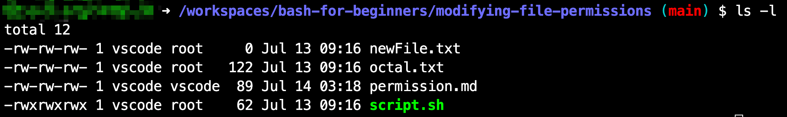

# Linux 权限管理

## Linux 权限概述

在 Linux 系统中，每个文件和目录都有访问权限，权限分为三类
- 文件所有者（user）
- 文件所属组（group）
- 和其他用户（others）

每类权限包括读（r）、写（w）、执行（x）三种。

## 查看文件权限

使用 `ls -l` 命令来查看文件的权限：

```bash
ls -l
```

### 输出示例：


### 输出解释：
1. `-rw-rw-rw-`：文件的权限和类型。
   - `-`：普通文件（其他可能包括 d 目录、l 符号链接）。
   - `rw-`：文件所有者权限（可读、可写、不可执行）。
   - `rw-`：文件所属组权限（可读、可写、不可执行）。
   - `rw-`：其他用户权限（可读、可写、不可执行）。
2. `1`：硬链接的数量。
3. `vscode`：文件所有者。
4. `root`：文件所属组。
5. `0`：文件大小（字节）。
6. `Jul 13 09:16`：最后修改时间。
7. `newFile.txt`：文件名称。

## 修改文件所有者：`chown`

查看文件权限：

```bash
ls -l newFile.txt
```

输出示例：

```plaintext
-rw-rw-rw- 1 vscode root 0 Jul 13 09:16 newFile.txt
```

将 `newFile.txt` 的所有者改为 `root`：

```bash
sudo chown root newFile.txt
```

## 修改文件组

```bash
sudo chown :vscode newFile.txt
```

**注意**
- 用户组的前面有 `:`。
- 只有文件的所有者、root 用户或 sudo 用户才可以更改文件的权限。

## 修改文件组：`chgrp`

```bash
chgrp vscode newFile.txt
```

## 修改文件权限：`chmod`

当脚本只有读写权限而没有执行权限时，执行脚本会收到错误：

```plaintext
-rw-rw-rw- 1 vscode root 62 Jul 13 09:16 script.sh
```

执行该文件会返回错误：

```plaintext
bash: ./script.sh: Permission denied
```

添加执行权限：

```bash
chmod +x script.sh
```

查看权限：

```plaintext
-rwxrwxrwx 1 vscode root 62 Jul 13 09:16 script.sh
```

## 通过八进制数字改变文件权限

示例命令：

```bash
chmod 777 script.sh
```

`chmod 777` 的含义是给所有用户增加读、写、执行的权限。下面解释八进制数字代表的含义。

## 使用八进制数字更改文件权限

八进制数字表示文件权限的每一位，分别对应用户（User）、组（Group）和其他用户（Others）的读（Read）、写（Write）和执行（Execute）权限。

### 八进制数字与权限位

| 权限   | 八进制值 |
| ------ | -------- |
| **无权限** | **0**        |
| **仅执行** | **1**        |
| **仅写入** | **2**        |
| 写入和执行 | 3    |
| **仅读取** | **4**        |
| 读取和执行 | 5    |
| 读取和写入 | 6    |
| 读取、写入和执行 | 7|

这些值的组合可以设置用户、组和其他用户的权限。

### 使用 `chmod` 命令的步骤

1. 确定所需的权限：
   - 用户（Owner）
   - 组（Group）
   - 其他用户（Others）

2. 组合八进制值：
   - 按顺序组合用户、组和其他用户的权限值。

3. 使用 `chmod` 命令：
   - 将八进制值传递给 `chmod` 命令，以设置文件或目录的权限。

### 示例

假设你有一个文件 `example.txt`，你想为该文件设置以下权限：
- 用户（Owner）：读取、写入和执行（7）
- 组（Group）：读取和执行（5）
- 其他用户（Others）：仅读取（4）

组合起来的八进制值是 `754`：

```bash
chmod 754 example.txt
```

### 更多示例

#### 示例 1：644

- 用户：6（读、写）
- 组：4（读）
- 其他用户：4（读）

#### 示例 2：600

- 用户：6（读、写）
- 组：0（无权限）
- 其他用户：0（无权限）

#### 示例 3：766

- 用户：7（读、写、执行）
- 组：6（读、写）
- 其他用户：6（读、写）
